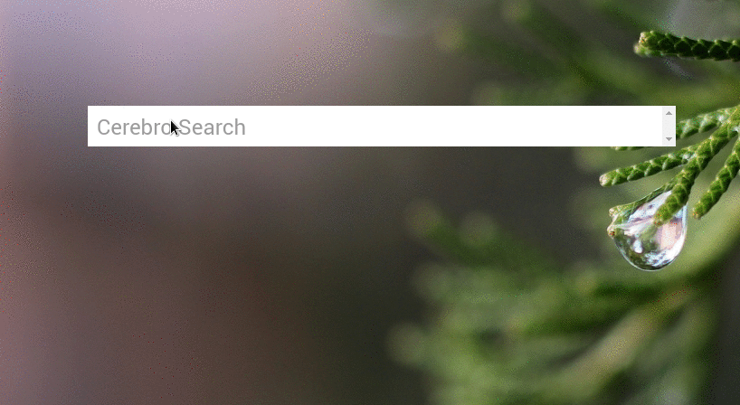

# Cerebro-mailinator

> Cerebro plugin for quickly access your [Mailinator](https://www.mailinator.com) inboxes.

## Related

* [Cerebro](http://github.com/KELiON/cerebro) – Plugin extracted from core Cerebro app;
* [cerebro-plugin](http://github.com/KELiON/cerebro-plugin) – boilerplate to create Cerebro plugins;
* [alfred-mailinator-workflow](https://github.com/AssafShalin/alfred-mailinator) - A Mailinator workflow for alfred, will generate a name, copy the generated email to clipboard, and open mailinator for you!

## License

MIT © [Bruno Paz](http://brunopaz.net)